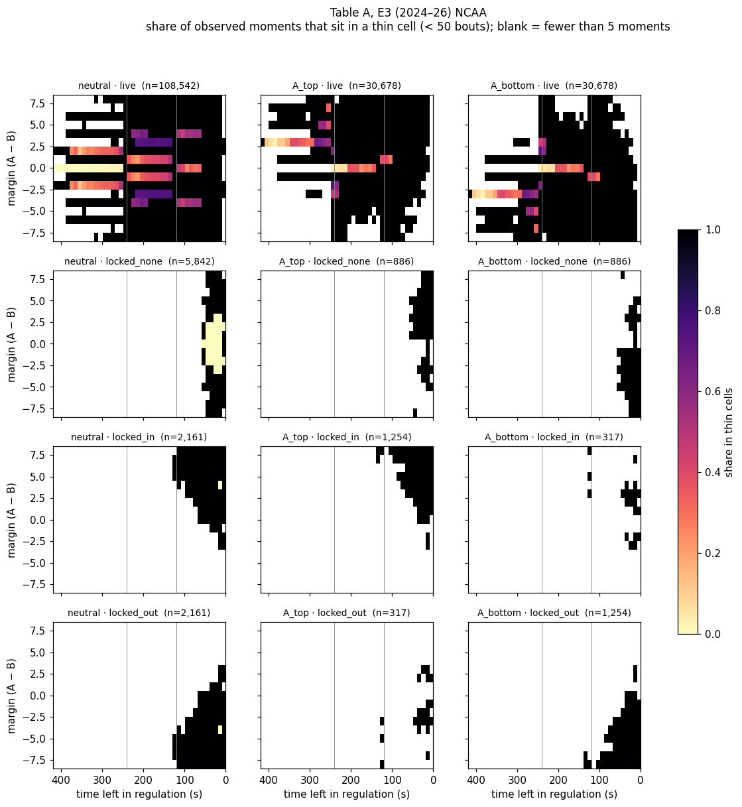
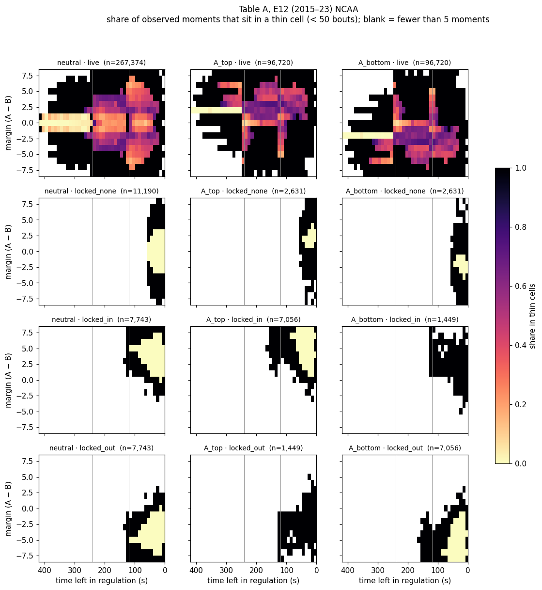
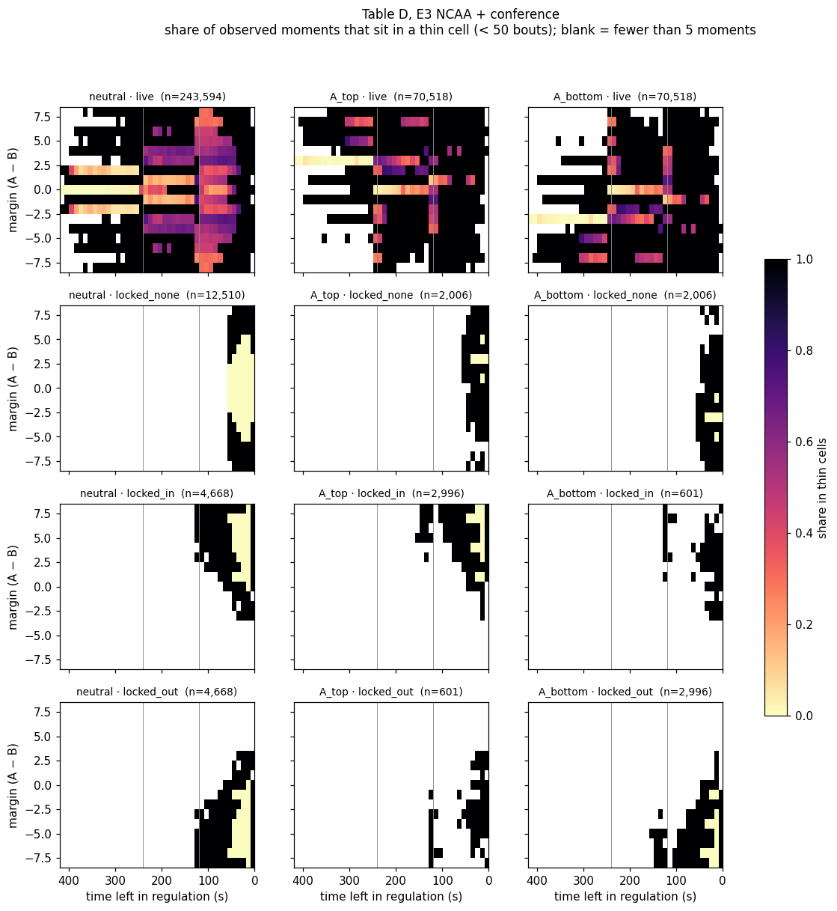
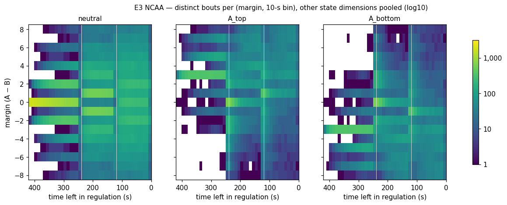

# WPA step 4 — sparsity audit (spec 3.2)

Generated by `scripts/wpa/sparsity_audit.py` from the step-3 observations (`scripts/wpa/build_table.py` → `data/wpa/table/`). **Thin** = a cell with fewer than 50 distinct bouts, the spec's threshold. A *moment* is one observation: a 10-second sample or the state just before / after an event, counted from both wrestlers' sides. Only bouts with `state_table_ok` (step 2) are used.

- NCAA: 6,526 bouts, 391,634 moments per side (257,775 10-s samples, 133,859 event before/after states).
- Conference (for the E3 question only — the spec folds conference in at step 10): 7,602 bouts, 445,102 moments per side.

## Headline

| Table | Bouts | Cells | Cells thin | Moments in thin cells | 10-s samples in thin cells | P3, within 3: in thin cells | Moments where cell + neighbours < 50 |
|---|---:|---:|---:|---:|---:|---:|---:|
| A. Spec key, eras split (E12 / E3) — NCAA | 6,526 | 42,226 | 94.9% | 41.6% | 36.6% | 52.6% | 11.3% |
| B. Spec key, eras pooled — NCAA | 6,526 | 27,363 | 90.7% | 31.1% | 26.9% | 37.5% | 6.1% |
| C. E3 only — NCAA | 1,792 | 18,209 | 97.9% | 56.0% | 50.0% | 75.6% | 21.2% |
| D. E3 only — NCAA + conference | 4,137 | 24,033 | 94.9% | 40.7% | 35.5% | 48.8% | 11.1% |
| C′. E3 NCAA, without rt_bin | 1,792 | 5,187 | 88.8% | 28.7% | 24.8% | 23.0% | 4.1% |
| C″. E3 NCAA, without rt_bin or choice | 1,792 | 4,255 | 85.6% | 24.0% | 20.4% | 23.0% | 3.2% |
| E. E12 only — NCAA (2015–23) | 4,734 | 24,017 | 92.7% | 36.2% | 31.5% | 44.9% | 7.6% |
| F. E3 NCAA, rt_bin only in the last 60 s | 1,792 | 6,863 | 92.3% | 31.6% | 28.1% | 36.6% | 6.0% |
| G. E3 NCAA + conference, rt_bin only in the last 60 s | 4,137 | 8,333 | 85.3% | 18.6% | 16.0% | 21.1% | 2.7% |

Columns: *Moments in thin cells* is the spec's key number (all observations); *10-s samples* counts only the fixed-cadence samples (time-uniform); *P3, within 3* restricts to the third period with the margin within 3 points — where win probability actually moves and where WPA credit is decided; *cell + neighbours < 50* is the spec 3.4 test: moments whose cell AND its margin ±1 / time ±10 s neighbours together hold fewer than 50 bouts, i.e. where smoothing alone has nothing to borrow.

## Cells by number of bouts (table A)

| Bouts in cell | Cells | Share of cells | Share of moments |
|---|---:|---:|---:|
| 1 | 13,534 | 32.1% | 2.2% |
| 2–4 | 12,140 | 28.8% | 5.5% |
| 5–9 | 6,562 | 15.5% | 7.1% |
| 10–24 | 5,476 | 13.0% | 13.4% |
| 25–49 | 2,374 | 5.6% | 13.4% |
| 50–99 | 1,274 | 3.0% | 13.9% |
| 100–249 | 690 | 1.6% | 15.9% |
| 250–499 | 128 | 0.3% | 6.7% |
| 500–999 | 16 | 0.0% | 2.9% |
| 1,000+ | 32 | 0.1% | 19.0% |

## Where the thin moments are (table A)

| Slice | Moments | In thin cells | Cell + neighbours < 50 |
|---|---:|---:|---:|
| E12, all | 571,394 | 36.2% | 7.6% |
| E3, all | 211,874 | 56.0% | 21.2% |
| Period 1 | 287,788 | 16.8% | 5.2% |
| Period 2 | 265,548 | 53.0% | 15.9% |
| Period 3 | 229,932 | 59.4% | 13.4% |
| Break states (pending choice) | 60,854 | 39.3% | 17.2% |
| rt_status live | 707,658 | 40.8% | 11.6% |
| rt_status locked (any) | 75,610 | 48.5% | 8.1% |
| E3, P3, within 3 | 34,748 | 75.6% | 20.6% |
| E3, last 30 s, within 3 | 7,870 | 57.8% | 13.5% |
| E3, P3, within 3, rt live | 26,240 | 83.9% | 23.9% |

Why so many thin cells: while `rt_status` is live the 13 riding-time bins split every state 13 ways, and before the last three minutes riding time is live in essentially every moment. With more than 3:00 left, 28.2% of live moments are in thin cells — yet the point can't be settled that early. Table C′ (no `rt_bin`) and C″ (no `rt_bin`, no `choice`) show how much of the thinness those two dimensions cause.

## Maps

Share of moments in thin cells, margin × time left, by position (columns) and `rt_status` (rows). Dark = thin. Vertical lines = period boundaries.

Raw volume, E3 NCAA (bouts per margin × time pixel, everything else pooled):

## The 30 thinnest cells that real bouts visit — third period, margin within 3 (table A, E3)

Thousands of cells hold a single bout, so a flat list of the 30 thinnest is arbitrary. These are the thinnest cells in the slice that decides bouts (E3, period 3, within 3 points), most-visited first among ties.

| Margin | Time left | Position | Choice | rt_status | rt_bin | Bouts | Moments | Win % (raw) | Bouts in cell + neighbours |
|---:|---|---|---|---|---:|---:|---:|---:|---:|
| +3 | 50–59 s | A_top | none | live | -6 | 1 | 6 | 100% | 19 |
| +2 | 40–49 s | A_bottom | none | live | +3 | 1 | 4 | 100% | 11 |
| +0 | 30–39 s | A_bottom | none | live | -3 | 1 | 3 | 0% | 10 |
| +0 | 30–39 s | A_top | none | live | +3 | 1 | 3 | 100% | 10 |
| +0 | 60–69 s | A_bottom | none | live | -3 | 1 | 3 | 0% | 40 |
| +0 | 60–69 s | A_top | none | live | +3 | 1 | 3 | 100% | 40 |
| +0 | 90–99 s | A_bottom | none | live | -5 | 1 | 3 | 100% | 15 |
| +0 | 90–99 s | A_top | none | live | +5 | 1 | 3 | 0% | 15 |
| +1 | 80–89 s | A_bottom | none | live | -6 | 1 | 3 | 100% | 15 |
| +2 | 20–29 s | A_top | none | live | +5 | 1 | 3 | 100% | 25 |
| +2 | 60–69 s | A_bottom | none | live | +4 | 1 | 3 | 100% | 9 |
| +2 | 60–69 s | A_bottom | none | locked_in | +0 | 1 | 3 | 100% | 14 |
| +0 | 10–19 s | A_bottom | none | live | +6 | 1 | 2 | 0% | 3 |
| +0 | 10–19 s | A_top | none | live | -6 | 1 | 2 | 100% | 3 |
| +0 | 20–29 s | A_bottom | none | locked_in | +0 | 1 | 2 | 0% | 10 |
| +0 | 20–29 s | A_top | none | locked_out | +0 | 1 | 2 | 100% | 10 |
| +0 | 30–39 s | neutral | none | live | -2 | 1 | 2 | 0% | 46 |
| +0 | 30–39 s | neutral | none | live | +2 | 1 | 2 | 100% | 46 |
| +0 | 40–49 s | A_bottom | none | locked_in | +0 | 1 | 2 | 0% | 9 |
| +0 | 40–49 s | A_top | none | locked_out | +0 | 1 | 2 | 100% | 9 |
| +0 | 80–89 s | A_bottom | none | live | +3 | 1 | 2 | 100% | 16 |
| +0 | 80–89 s | A_top | none | live | -3 | 1 | 2 | 0% | 16 |
| +0 | 120–129 s | A_bottom | none | live | -3 | 1 | 2 | 0% | 8 |
| +0 | 120–129 s | A_top | none | live | +3 | 1 | 2 | 100% | 8 |
| +0 | 120–129 s | neutral | none | live | -3 | 1 | 2 | 0% | 23 |
| +0 | 120–129 s | neutral | none | live | -2 | 1 | 2 | 0% | 29 |
| +0 | 120–129 s | neutral | none | live | -1 | 1 | 2 | 0% | 57 |
| +0 | 120–129 s | neutral | none | live | +1 | 1 | 2 | 100% | 57 |
| +0 | 120–129 s | neutral | none | live | +2 | 1 | 2 | 100% | 29 |
| +0 | 120–129 s | neutral | none | live | +3 | 1 | 2 | 100% | 23 |

## Same state, different era (spec Section 4)

Raw win rate for wrestler A in a few common states, pooled over riding time and choice so the cells are big enough to compare. 95% intervals are ± about 2·√(p(1−p)/n) with n = bouts.

| State | E12 NCAA (2015–23) | E3 NCAA (2024–26) | E3 conference |
|---|---:|---:|---:|
| Tied, start of period 2, A on bottom | 56% (1,308) | 55% (628) | 58% (776) |
| Up 1, start of period 3, A on bottom | 90% (295) | 77% (112) | 82% (156) |
| Down 1, start of period 3, A on bottom | 40% (684) | 43% (326) | 40% (379) |
| Tied, start of period 3, A on bottom | 78% (441) | 70% (84) | 83% (100) |
| Up 2, 1:00 left, neutral | 93% (487) | 84% (220) | 87% (251) |
| Up 3, 1:00 left, neutral | 97% (360) | 92% (126) | 96% (171) |
| Up 3, 1:00 left, A on top | 99% (240) | 95% (73) | 98% (75) |
| Down 2, 0:30 left, A on bottom | 4% (251) | 8% (31) | 4% (45) |
| Up 1, 0:30 left, neutral | 88% (621) | 80% (141) | 87% (184) |
| Up 1, 0:30 left, A on bottom | 82% (57) | — (12) | — (17) |
| Up 5, anywhere in period 2, neutral | 96% (246) | 97% (120) | 96% (144) |

(win % (bouts); rows with fewer than 20 bouts show —.)

## Reading it

1. **The spec's full state key is far too fine for this much data.** Most cells hold a handful of bouts; 41.6% of all NCAA moments and 56.0% of E3 moments sit in thin cells, and in the part that decides bouts (period 3, within 3 points) it's 75.6% for E3. The spec's rule was: keep 3.3 minimal and skip 3.4 only if thin cells carry a trivial share of real moments. They don't.
2. **The parametric backstop (3.4) is needed.** Moments whose cell *and* its margin ±1 / time ±10 s neighbours together hold fewer than 50 bouts: 11.3% (all NCAA), 21.2% (E3 NCAA). Smoothing alone has nothing to borrow there.
3. **Riding-time bins are the main cause.** Dropping `rt_bin` takes E3 period-3 close moments from 75.6% thin to 23.0%; `choice` barely matters (C″). Keeping riding-time bins only for the last 60 s: 36.6% (F). But collapsing `rt_bin` earlier throws away real information (55 s up with 1:30 left is very likely a point), so the better fix is to keep the key and let smoothing borrow across neighbouring riding-time bins too, with the backstop carrying riding time as a feature.
4. **Eras really do differ, as the spec expected.** A 2-point lead with a minute left held 93% of the time in 2015–23 and 84% in 2024–26 — one 3-point takedown now erases it. Pooling eras (table B) looks less sparse but mixes two different meanings of the same margin, so it isn't a real fix.
5. **Conference E3 behaves like NCAA E3** in the comparison table (differences within noise), and adding it cuts E3 thinness from 56.0% to 40.7% of moments (75.6% → 48.8% in period 3 close). That is the cleanest way to thicken E3 — same rules, same scoring — better than borrowing 2015–23 margins.

