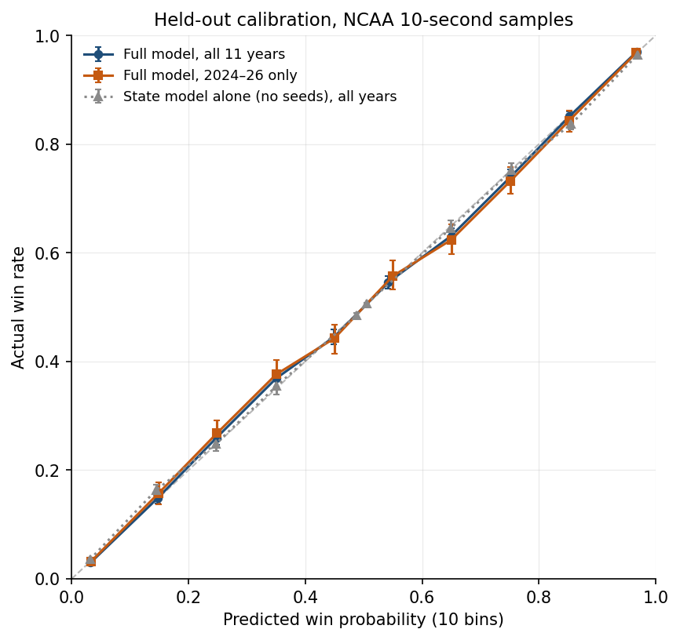
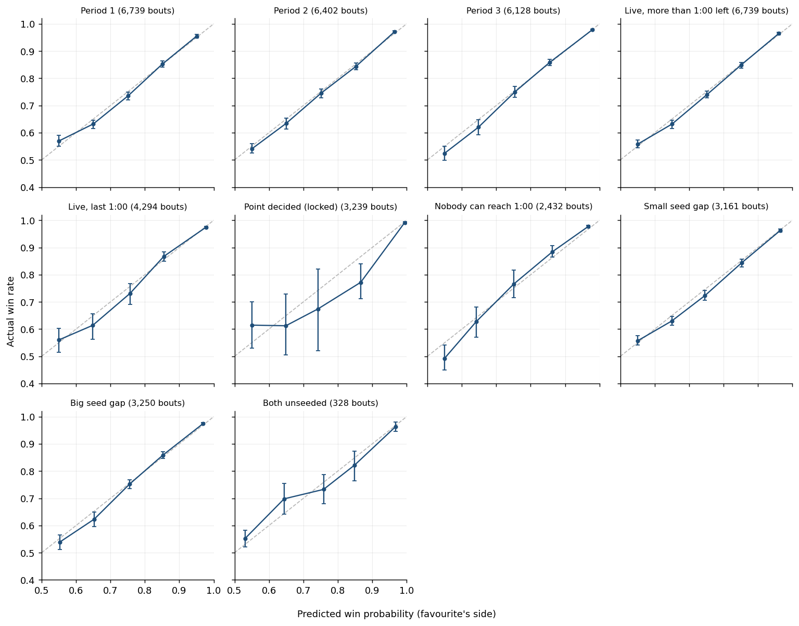

# WPA step 8 — validation

Generated by `scripts/wpa/validate.py` (spec Section 7). Model = the step 5–6 state model (riding time factored out) + the step-7 seed layer, fitted by `fit_state_model.py` / `fit_strength.py`; one predictor for everything downstream: `scripts/wpa/wp_model.py`. Baselines (spec 7.3): **margin + time only** (logistic on margin and time left) and the **state model alone** (no seeds).

Scored on the 10-second samples of NCAA bouts (opening whistle, then the centre of every 10-second bin), both wrestlers' sides; log loss (guessing 50% = 0.693) and Brier score, lower is better. Intervals are 90% bootstrap intervals over bouts. Hyperparameters were chosen on these same held-out years in steps 5–7 (a handful of numbers against ~550k samples: little optimism, but not none).

**Changes made during this step** (each found by the validation, each re-validated here):

1. **Moments just before an event were biased.** Spec 3.1 puts the state just before every event into the table. A moment chosen because something is about to happen isn't a typical moment. Late in close bouts that something is usually the trailing wrestler scoring, so in the same cells leaders won 7–8 points less often at those moments than at the 10-second samples. The row set was put to a held-out test (`state_model.md`, "Which moments feed the model"). Chosen: **10-s samples + the state just after every event + break states; in-period 'just before' states dropped**.
2. **The last 10 seconds were never sampled.** The old grid (420, 410 … 10 s left) sat on bin edges, so the 0:00–0:09 bin was built only from event moments, half of them the biased kind. Samples now sit at bin centres (415 … 5) plus the opening whistle.
3. **The tie model** (the chance a bout is tied at the end of regulation, which carries the seed effect into overtime) put "tied, 0:05 left, neutral, nobody can reach 1:00" at 56% to reach overtime, against 89% in the data, and it disagreed with the riding-time model (as a favourite's riding-time lead grew, his WP could fall by up to 7 points). It now uses the state model's own split — P(tie) = Σ over the eventual riding-time point r of P(r | state) × P(tie | state, r) — on the unbiased moments, symmetrised.
4. **The riding-time model missed the knife edge.** "A on top, 5 s left, needs all 5 to reach 1:00": the model said 58%, the data 89–96%. It now has the share of the remaining time each wrestler must still ride, who holds the next choice and whether it's a break; it is monotone in both wrestlers' remaining need (without that, WP could fall as a riding-time lead grew); and it is exact per wrestler whenever the clock decides it (the spec's four-way status calls a state "live" when only one wrestler can still reach 1:00, and the model was left guessing for the other). Whether it's also monotone in margin is chosen on held-out WP (`state_model.md`): free fits the point better (a big lead often ends in a tech fall with no point), monotone keeps WP rising with the margin. **After step 9** (TJ): the trees still missed this edge (69%). A simple rate model with an exact dynamic program (`scripts/wpa/rt_hazard.py`) gets it right but gives worse WP early in bouts, so the riding-time model is now a blend: the trees until 1:30 left, a linear handoff, the rate model alone from 0:30 (`state_model.md`, "Riding-time point model").
5. **The table is now also monotone in the eventual riding-time point** (B's point ≤ nobody's ≤ A's point), alternated with the margin projection.
6. **The seed layer double-counted strength.** The state table already builds in that leaders are usually the better wrestler, so adding the full seed shift made evenly matched bouts overconfident (calibration slope 0.80 with a small seed gap, 0.76 with both unseeded; 0.96 with a big gap). The seed layer now scales the state part, logit(WP) = α·logit(WP_state) + …, with the form of α chosen leave-one-year-out (`strength_layer.md`). The spec's form is α = 1. α never depends on the seed gap: WP must rise with the seed advantage.
7. **The table respects the release option.** The top wrestler can always let his man go, so A on top at margin m is worth at least neutral at m − 1 — and, mirrored, an escape can't lower the escaper's WP. Before, 2.7% of escapes had negative WPA (largest 4.4 points). With margin monotonicity this also covers takedowns and reversals.

Steps 2–7 were re-run with these changes; `state_model.md` and `strength_layer.md` are current. **Before the step-8 changes** (same validation): held-out log loss 0.3967 all years / 0.4198 in 2024–26; calibration slope 0.880 / 0.850; 5 of 7 hand checks; WP fell as the margin grew in 2,404 grid steps and as a riding-time lead grew in 40,548; 3.04% of scoring events lowered the scorer's WP.

## Summary

- **Held out, all 11 NCAA years (leave one year out):** log loss 0.456 margin + time → 0.446 state model → **0.393 full model**; 2024–26 (TJ's rotation) 0.472 → 0.466 → **0.414**.
- **Forward in time** (trained only on earlier years): 2024 0.415 (vs 0.412 leave-one-out); 2025 0.412 (vs 0.412 leave-one-out); 2026 0.419 (vs 0.419 leave-one-out).
- **Calibration:** recalibration slope 0.997 (90% 0.965–1.030) on all years, 0.968 (0.909–1.026) on 2024–26 (1 = calibrated, < 1 overconfident); largest decile gap 1.9 points (all years).
- **Hand-checked states:** 7 of 7 pass.
- **Monotonicity:** 10,784 table cells with data adjusted by the projections (max 0.149); final WP (with seeds) falling as the margin grows: 4 grid steps; as a riding-time lead grows: 0; as the seed advantage grows: 0.
- **Negative scoring WPA (preliminary):** 198 of 38,547 NCAA scoring events (0.51%) lower the scorer's WP; largest 0.001.

- **Conference tournaments (step 10), held out, leak-free seasons:** log loss 0.435 state model → **0.379** with national rank; calibration slope 0.997 (section 9).

## 1. Holdout by tournament year (spec 7.1) and log loss / Brier vs the baselines (7.3)

**Leave one tournament out.** Every model piece refitted without the held-out year (NCAA and conference). The 2024–26 rows are TJ's rotation.

| Held-out year | Bouts | Log loss: margin + time | Log loss: state model | Log loss: **full model** | Brier: margin + time | Brier: state model | Brier: **full model** |
|---|---:|---:|---:|---:|---:|---:|---:|
| 2015 | 611 | 0.4644 | 0.4505 | **0.4071** | 0.1552 | 0.1511 | **0.1337** |
| 2016 | 611 | 0.4676 | 0.4490 | **0.4045** | 0.1556 | 0.1498 | **0.1319** |
| 2017 | 610 | 0.4188 | 0.4133 | **0.3609** | 0.1408 | 0.1385 | **0.1169** |
| 2018 | 613 | 0.4312 | 0.4154 | **0.3727** | 0.1443 | 0.1387 | **0.1212** |
| 2019 | 620 | 0.4344 | 0.4233 | **0.3719** | 0.1458 | 0.1420 | **0.1219** |
| 2021 | 609 | 0.4463 | 0.4349 | **0.3902** | 0.1494 | 0.1465 | **0.1293** |
| 2022 | 612 | 0.4707 | 0.4661 | **0.3852** | 0.1588 | 0.1578 | **0.1251** |
| 2023 | 612 | 0.4704 | 0.4528 | **0.3848** | 0.1560 | 0.1505 | **0.1248** |
| 2024 | 617 | 0.4721 | 0.4646 | **0.4119** | 0.1602 | 0.1577 | **0.1366** |
| 2025 | 616 | 0.4742 | 0.4698 | **0.4117** | 0.1603 | 0.1581 | **0.1342** |
| 2026 | 608 | 0.4705 | 0.4633 | **0.4193** | 0.1593 | 0.1564 | **0.1389** |
| **All 11 years** | 6,739 | 0.4565 | 0.4458 | **0.3928** | 0.1533 | 0.1498 | **0.1286** |
| 2015–2023 | 4,898 | 0.4506 | 0.4382 | **0.3847** | 0.1508 | 0.1469 | **0.1256** |
| **2024–2026 (TJ's rotation)** | 1,841 | 0.4723 | 0.4659 | **0.4143** | 0.1599 | 0.1574 | **0.1365** |

**Forward in time** (the spec's "train on earlier years, test on the most recent"). 2024 is a cold start under new rules: no 2024–26 data at all, so its states are read from the 2015–23 table — what the model would have said in the first season of the 3-point takedown.

| Test year | Trained on | Bouts | Margin + time | State model | **Full model** | Brier, full | Same year, leave-one-out (full) |
|---|---|---:|---:|---:|---:|---:|---:|
| 2024 | 2015–2023 (no 2024–26 data: E12 table used) | 617 | 0.4832 | 0.4680 | **0.4152** | 0.1375 | 0.4119 |
| 2025 | 2015–2024 | 616 | 0.4741 | 0.4706 | **0.4122** | 0.1343 | 0.4117 |
| 2026 | 2015–2025 | 608 | 0.4705 | 0.4633 | **0.4193** | 0.1389 | 0.4193 |

Strength-layer parameters per held-out year (spread = how stable the fit is): 2015: β0 1.60, γ 0.61, β_ot 0.53, E3 × 0.85, α 0.63+0.34·elapsed, 2016: β0 1.59, γ 0.61, β_ot 0.48, E3 × 0.86, α 0.64+0.32·elapsed, 2017: β0 1.53, γ 0.61, β_ot 0.51, E3 × 0.89, α 0.63+0.35·elapsed, 2018: β0 1.56, γ 0.60, β_ot 0.45, E3 × 0.87, α 0.60+0.37·elapsed, 2019: β0 1.55, γ 0.59, β_ot 0.51, E3 × 0.87, α 0.64+0.32·elapsed, 2021: β0 1.60, γ 0.63, β_ot 0.51, E3 × 0.85, α 0.64+0.33·elapsed, 2022: β0 1.51, γ 0.65, β_ot 0.52, E3 × 0.91, α 0.66+0.31·elapsed, 2023: β0 1.53, γ 0.63, β_ot 0.52, E3 × 0.89, α 0.65+0.31·elapsed, 2024: β0 1.56, γ 0.61, β_ot 0.49, E3 × 0.88, α 0.66+0.29·elapsed, 2025: β0 1.56, γ 0.61, β_ot 0.50, E3 × 0.83, α 0.65+0.33·elapsed, 2026: β0 1.54, γ 0.59, β_ot 0.55, E3 × 0.90, α 0.64+0.33·elapsed.

## 2. Calibration (spec 7.2)

Full model, leave-one-year-out, 10 equal-width bins of predicted WP (symmetric: each bin mirrors its opposite).

| Predicted | Samples | Bouts | Mean predicted | Actual (all years) | 90% interval | 2024–26: predicted | 2024–26: actual |
|---|---:|---:|---:|---:|---:|---:|---:|
| 0–10% | 109,022 | 5,973 | 3.2% | 3.0% | 2.7%–3.3% | 3.3% | 3.2% |
| 10–20% | 46,079 | 5,386 | 14.8% | 14.9% | 13.9%–16.0% | 14.9% | 15.7% |
| 20–30% | 42,013 | 4,605 | 24.8% | 26.0% | 24.7%–27.2% | 24.9% | 26.8% |
| 30–40% | 38,361 | 3,797 | 35.0% | 36.9% ▲ | 35.4%–38.4% | 35.0% | 37.6% |
| 40–50% | 33,819 | 3,094 | 44.9% | 44.4% | 43.1%–45.8% | 45.0% | 44.3% |
| 50–60% | 41,289 | 3,274 | 54.2% | 54.6% | 53.4%–55.7% | 55.0% | 55.7% |
| 60–70% | 38,361 | 3,797 | 65.0% | 63.1% ▼ | 61.6%–64.6% | 65.0% | 62.4% |
| 70–80% | 42,013 | 4,605 | 75.2% | 74.0% | 72.8%–75.3% | 75.1% | 73.2% |
| 80–90% | 46,079 | 5,386 | 85.2% | 85.1% | 84.0%–86.1% | 85.1% | 84.3% |
| 90–100% | 109,022 | 5,973 | 96.8% | 97.0% | 96.7%–97.3% | 96.7% | 96.8% |

▼ = prediction above the 90% interval of the actual rate (overconfident there), ▲ = below (underconfident).

Recalibration slope (logistic fit of the outcome on logit WP; 1 = calibrated, < 1 = overconfident): full model 0.997 (0.965–1.030); 2024–26 0.968 (0.909–1.026); state model alone 0.943 (0.912–0.976). Last minute, margin within 2: 0.981 (0.941–1.030).

## 4. Calibration by rank-gap bucket (spec 7.4)

Rank signal = strength(A) − strength(B) on the fitted seed scale. Small / big gap split at the median gap among seeded matchups (0.63, about 11 vs 22, 11 vs unseeded, 7 vs 16). From the favourite's side:

| Bucket | Phase | Bouts | Favourite's predicted WP | Actual | 90% interval | State model alone |
|---|---|---:|---:|---:|---:|---:|
| Small seed gap | Period 1 | 3,161 | 62.8% | 63.2% | 61.8%–64.6% | 53.7% |
| Small seed gap | Period 2 | 3,032 | 63.1% | 63.1% | 61.6%–64.5% | 58.7% |
| Small seed gap | Period 3 | 2,948 | 63.3% | 63.1% | 61.6%–64.6% | 61.6% |
| Small seed gap | **All** | 3,161 | 63.0% | 63.2% | 61.8%–64.5% | 57.2% |
| Big seed gap | Period 1 | 3,250 | 84.2% | 84.1% | 83.1%–85.3% | 61.6% |
| Big seed gap | Period 2 | 3,059 | 83.9% | 83.9% | 82.8%–85.0% | 74.5% |
| Big seed gap | Period 3 | 2,886 | 82.7% | 83.3% | 82.1%–84.5% | 79.2% |
| Big seed gap | **All** | 3,250 | 83.7% | 83.8% | 82.6%–84.9% | 69.7% |

Recalibration slope by bucket (both sides): Small seed gap 0.948 (0.903–0.990); Big seed gap 1.037 (0.986–1.095); Both unseeded 0.942 (0.801–1.097). The spec's reading: big-gap bouts overconfident → β0 too high; miscalibration concentrated late → γ off.

**Opening whistle** — at 7:00 the state is always tied and neutral, so seeds are the only information and this is the cleanest check of β0 and the seed scale (favourite's side, one row per bout):

| Rank signal | Most common matchup | Bouts | Predicted | Actual | 90% interval |
|---|---|---:|---:|---:|---:|
| 0.00–0.25 | 8 vs 9 | 1,157 | 55.1% | 58.9% ▲ | 56.3%–61.4% |
| 0.25–0.50 | 6 vs 11 | 1,316 | 64.4% | 64.2% | 62.1%–66.7% |
| 0.50–1.00 | 12 vs unseeded | 2,166 | 75.5% | 74.2% | 72.7%–75.7% |
| 1.00–1.50 | 3 vs 14 | 1,188 | 86.5% | 87.6% | 86.0%–89.2% |
| 1.50+ | 2 vs unseeded | 584 | 94.9% | 96.1% | 94.5%–97.4% |

## 5. Calibration by period and by riding-time status (spec 7.5)

| Slice | Bouts | Samples | Log loss: margin + time | State model | **Full model** | Slope (90%) |
|---|---:|---:|---:|---:|---:|---:|
| Period 1 | 6,739 | 251,638 | 0.5894 | 0.5854 | **0.4913** | 1.00 (0.96–1.03) |
| Period 2 | 6,402 | 150,912 | 0.4215 | 0.4014 | **0.3739** | 1.01 (0.98–1.05) |
| Period 3 | 6,128 | 143,508 | 0.2602 | 0.2477 | **0.2398** | 0.98 (0.95–1.02) |
| Live, more than 1:00 left | 6,739 | 466,250 | 0.5021 | 0.4918 | **0.4302** | 1.00 (0.97–1.04) |
| Live, last 1:00 | 4,294 | 26,380 | 0.2557 | 0.2388 | **0.2350** | 0.97 (0.92–1.03) |
| Point decided (locked) | 3,239 | 35,110 | 0.0701 | 0.0560 | **0.0544** | 0.88 (0.80–0.97) |
| Nobody can reach 1:00 | 2,432 | 18,318 | 0.3260 | 0.3209 | **0.3141** | 1.09 (1.04–1.17) |
| Small seed gap | 3,161 | 259,868 | 0.5102 | 0.4991 | **0.4818** | 0.95 (0.90–0.99) |
| Big seed gap | 3,250 | 259,710 | 0.3978 | 0.3873 | **0.2939** | 1.04 (0.99–1.10) |
| Both unseeded | 328 | 26,480 | 0.5048 | 0.4967 | **0.4891** | 0.94 (0.80–1.10) |

Favourite's side, predicted → actual per bin (▼ overconfident / ▲ underconfident beyond the 90% interval; bins with fewer than 30 bouts left out):

| Bin | Period 1 | Period 2 | Period 3 | Live, more than 1:00 left | Live, last 1:00 | Point decided (locked) | Nobody can reach 1:00 | Small seed gap | Big seed gap | Both unseeded |
|---|---:|---:|---:|---:|---:|---:|---:|---:|---:|---:|
| 50–60% | 55 → 57 | 55 → 54 | 55 → 52 ▼ | 55 → 56 | 55 → 54 | 55 → 61 | 55 → 49 ▼ | 55 → 56 | 55 → 54 | 53 → 55 |
| 60–70% | 65 → 63 ▼ | 65 → 63 | 65 → 62 ▼ | 65 → 63 ▼ | 65 → 62 | 65 → 62 | 64 → 63 | 65 → 63 ▼ | 65 → 62 ▼ | 64 → 70 |
| 70–80% | 75 → 74 ▼ | 75 → 75 | 75 → 75 | 75 → 74 | 76 → 75 | 74 → 67 | 75 → 77 | 75 → 72 ▼ | 76 → 75 | 76 → 73 |
| 80–90% | 85 → 85 | 85 → 84 | 86 → 86 | 85 → 85 | 86 → 87 | 87 → 78 ▼ | 86 → 88 | 85 → 84 | 85 → 86 | 85 → 82 |
| 90–100% | 95 → 95 | 96 → 97 ▲ | 98 → 98 | 96 → 96 | 98 → 97 | 99 → 99 ▼ | 97 → 98 ▲ | 97 → 96 | 97 → 97 ▲ | 97 → 96 |

## 6. Hand-checked states (spec 7.6)

Final model (fitted on all data), 2024–26 rules; no seeds unless stated (equal seeds = rank signal 0). P(A pt) / P(B pt) = the riding-time model's chance of each wrestler getting the point.

| State | Spec expects | P(A pt) | P(B pt) | WP, state | WP, with seeds | Check |
|---|---|---:|---:|---:|---:|:---:|
| Tied, 7:00 left, neutral, equal seeds | ≈ 50% | 19% | 19% | 50.0% | 50.0% | ✓ |
| Tied, 0:30 left, A on bottom (riding time: nobody can reach 1:00) | modestly above 50% | 0% | 0% | 51.2% | 51.1% | ✓ |
|   … same, but B has +0:45 riding time (B can still earn the point) | (below the row above) | 0% | 70% | 21.5% | 22.7% |  |
| A down 1, start of period 3, A holds the choice | close to a coin flip | 2% | 19% | 34.9% | 36.7% | ✓ |
|   … A picks bottom |  | 2% | 21% | 35.8% | 37.5% |  |
|   … A picks top |  | 8% | 5% | 26.2% | 28.7% |  |
|   … A picks neutral |  | 3% | 7% | 28.3% | 30.7% |  |
|   … same, B holds the choice |  | 8% | 6% | 26.6% | 29.1% |  |
| A up 1, 0:05 left, A on top, A +0:55 riding time (live) | A likely secures the point | 89% | 0% | 98.7% | 98.4% | ✓ |
| A up 1, 0:04 left, A on top, A +0:55 riding time (out of reach) | noticeably different | 0% | 0% | 93.2% | 92.6% | ✓ |
|   tied, 0:05 left, A on top, A +0:55 (live) |  | 89% | 0% | 93.6% | 93.0% |  |
|   tied, 0:04 left, A on top, A +0:55 (out of reach) |  | 0% | 0% | 70.1% | 69.5% |  |
| 1 seed vs 16 seed, tied, start of the match | heavily favours the 1 seed | 19% | 19% | 50.0% | 92.9% | ✓ |
| 1 seed vs 16 seed, 1 seed down 3, 0:10 left, neutral | rank barely matters | 0% | 0% | 3.3% | 4.7% | ✓ |
|   … same, equal seeds |  | 0% | 0% | 3.3% | 3.7% |  |
| 1 seed vs 16 seed, tied, 0:05 left, neutral (overtime likely) |  | 0% | 0% | 50.0% | 73.8% |  |

Check rules: tied start within 0.5 points of 50%; tied 0:30 bottom between 50% and 70%; down 1 with the choice between 35% and 60%; 0:05 riding-time state: P(A's point) > 75% and WP above the 0:04 state; 0:04: P(A's point) = 0 (out of reach) and WP lower; 1 v 16 start > 85%; 1 seed down 3 at 0:10: seeds move WP by less than 3 points, and not below the equal-seeds value.

The 0:05 riding-time state (A on top, needing every one of the last seconds to reach 1:00) is the thinnest in the data: 1–5 held-out moments a year, A got the point in all of them. The step-8 trees put it anywhere from 53% to 78% depending on the training years; the blend (the rate model alone at 0:05) gives 89% — the chance of no escape, reversal or early end in 5 seconds — which is what the data says.

## 7. Monotonicity (spec 3.5 / 7.7)

- **Table projections (step 6: margin, riding-time point, release option):** 89,028 of 421,848 grid cells adjusted (10,784 with data); largest change 0.149, mean 0.0056.
- **Eventual riding-time point** (the table should rank B's point ≤ none ≤ A's point in every cell): 0 of 281,232 adjacent pairs out of order (0 where both cells have data; 0 by more than 2 points; largest 0.000).
- **Release option** (A on top at m ≥ neutral at m − 1; mirrored, bottom at m ≤ neutral at m + 1): 7,488 of 136,080 pairs out of order, largest 7.32e-03.
- **WP in the riding-time differential**, period 3, no seeds: 89,964 one-second steps, 0 drops (0 with riding time live at both ends), largest 0.0000.
- **WP in the riding-time differential**, period 3, A = 1 seed vs 16: 89,964 one-second steps, 0 drops (0 with riding time live at both ends), largest 0.0000.
- **WP in the riding-time differential**, period 3, A = 16 seed vs 1: 89,964 one-second steps, 0 drops (0 with riding time live at both ends), largest 0.0000.
- **Final WP in margin** (all times, positions, choices; riding time −30/0/+30), no seeds: 9,576 steps, 0 drops, largest 0.0001.
- **Final WP in margin** (all times, positions, choices; riding time −30/0/+30), A = 1 seed vs 16: 9,576 steps, 2 drops, largest 0.0002 (at {'margin': -7, 't_rem': 65, 'pos': 'A_bottom', 'choice': 'none', 'rt_diff': -30.0}).
- **Final WP in margin** (all times, positions, choices; riding time −30/0/+30), A = 16 seed vs 1: 9,576 steps, 2 drops, largest 0.0002 (at {'margin': 8, 't_rem': 65, 'pos': 'A_top', 'choice': 'none', 'rt_diff': 30.0}).
- **Final WP in the seed advantage** (A seeded 1–33 or unseeded vs a 16 seed / an unseeded B, 77 states per era across the match): 24,684 steps, 0 drops, largest 0.0000.

A drop = WP falling by more than 0.01 points as the quantity grows (smaller moves are floating-point noise).

## 8. Negative scoring WPA (spec 6.2 / 7.8) — preliminary

Every NCAA regulation scoring event in a model-quality bout, scored with the final model from the scorer's side (a score that reaches a 15-point margin ends the bout: WP after = 1). 38,547 events. The full WPA and its decomposition are step 9; this is the bug check.

| Event | Events | Negative (full model) | Negative (state model) | Mean WPA |
|---|---:|---:|---:|---:|
| adjustment | 42 | 4 | 5 | +0.061 |
| escape | 17,051 | 53 | 43 | +0.062 |
| near_fall | 2,382 | 20 | 19 | +0.080 |
| penalty | 1,807 | 90 | 64 | +0.046 |
| reversal | 1,924 | 0 | 0 | +0.164 |
| takedown | 15,341 | 31 | 31 | +0.142 |

Worst cases:

| Bout | Event | Before (scorer's side) | After | WP before → after |
|---|---|---|---|---|
| 2023 285 #8 | Escape (1:40) | +5, P3 1:40, A_top, RT +133 | +6, neutral, RT +133 | 99.8% → 99.8% |
| 2021 165 #18 | Escape (1:00) | -9, P3 1:00, A_bottom, RT -163 | -8, neutral, RT -163 | 0.1% → 0.0% |
| 2021 165 #18 | Takedown (1:12) | +7, P3 1:12, neutral, RT +151 | +9, A_top, RT +151 | 100.0% → 99.9% |
| 2019 184 #35 | Escape (1:12) | -8, P3 1:12, A_bottom, RT -159 | -7, neutral, RT -159 | 0.0% → 0.0% |
| 2019 184 #35 | Takedown (1:01) | +7, P3 1:01, neutral, RT +159 | +9, A_top, RT +159 | 100.0% → 100.0% |
| 2015 157 #58 | Escape (1:00) | -8, P3 1:00, A_bottom, RT -224 | -7, neutral, RT -224 | 0.0% → 0.0% |
| 2016 141 #24 | Escape (1:14) | -9, P3 1:14, A_bottom, RT -147 | -8, neutral, RT -147 | 0.0% → 0.0% |
| 2018 125 #28 | Escape (1:07) | -8, P3 1:07, A_bottom, RT -161 | -7, neutral, RT -161 | 0.0% → 0.0% |
| 2018 125 #11 | Escape (1:04) | -9, P3 1:04, A_bottom, RT -156 | -8, neutral, RT -156 | 0.0% → 0.0% |
| 2015 149 #6 | Escape (1:05) | -9, P3 1:05, A_bottom, RT -210 | -8, neutral, RT -210 | 0.0% → 0.0% |
| 2023 285 #22 | Escape (1:06) | -8, P3 1:06, A_bottom, RT -249 | -7, neutral, RT -249 | 0.0% → 0.0% |
| 2015 141 #59 | Escape (1:06) | -8, P3 1:06, A_bottom, RT -150 | -7, neutral, RT -150 | 0.0% → 0.0% |

## Tie model (the overtime seed term)

Held-out (leave one year out) calibration of P(tied at the end of regulation) against whether the bout went to overtime:

| Predicted | Samples | Mean predicted | Actual |
|---|---:|---:|---:|
| 0–10% | 368,408 | 3.7% | 3.9% |
| 10–20% | 119,686 | 13.9% | 14.2% |
| 20–30% | 34,422 | 24.0% | 26.9% |
| 30–40% | 8,124 | 33.4% | 34.9% |
| 40–50% | 4,116 | 45.4% | 49.1% |
| 50–60% | 3,502 | 54.7% | 57.2% |
| 60–70% | 3,058 | 64.6% | 65.4% |
| 70–80% | 2,292 | 74.9% | 78.1% |
| 80–90% | 1,382 | 84.1% | 84.9% |
| 90–100% | 1,068 | 93.7% | 95.1% |

Tied late with nobody able to reach 1:00 of riding time (the case the first version got wrong):

| Time left | Position | Samples | Predicted | Actual |
|---|---|---:|---:|---:|
| 0:05 | neutral | 1,040 | 93.7% | 95.0% |
| 0:05 | A_top | 28 | 85.2% | 78.6% |
| 0:15 | neutral | 1,038 | 84.5% | 86.5% |
| 0:15 | A_top | 23 | 62.6% | 52.2% |
| 0:25 | neutral | 996 | 77.9% | 80.7% |
| 0:25 | A_top | 22 | 51.4% | 45.5% |
| 0:55 | neutral | 358 | 63.6% | 69.3% |

## 9. Conference tournaments, national rank (step 10)

Held out by season, leak-free seasons only (2023, 2024, 2025, 2026; Flo rank snapshot from before the conference tournaments — `conf_ranks.md`). State model out of fold; the rank layer's conference parameters refitted without the held-out season (`strength_layer.md`).

| Slice | Samples | Bouts | Log loss, state model | Log loss, with ranks | Calibration slope |
|---|---:|---:|---:|---:|---:|
| All | 252,298 | 3,197 | 0.4355 | 0.3792 | 0.997 |
| Both ranked | 80,530 | 984 | 0.4730 | 0.4265 | 0.961 |
| One ranked | 89,526 | 1,181 | 0.3799 | 0.2628 | 1.050 |
| Neither ranked | 82,242 | 1,032 | 0.4591 | 0.4596 | 0.959 |

Favourite's side, held out:

| Predicted | Samples | Mean predicted | Actual |
|---|---:|---:|---:|
| 50–60% | 13,939 | 54.0% | 55.5% (90% 53.6%–57.3%) |
| 60–70% | 11,393 | 64.9% | 64.4% (90% 62.0%–67.0%) |
| 70–80% | 15,368 | 75.2% | 75.4% (90% 73.8%–77.6%) |
| 80–90% | 21,508 | 85.2% | 86.2% (90% 84.8%–87.5%) |
| 90–100% | 54,214 | 96.9% | 96.7% (90% 96.2%–97.2%) |

## Rules eras side by side (spec Section 4)

State model, no seeds. The 3-point takedown (2024–26) makes the same lead worth less.

| State | 2015–23 | 2024–26 | Difference |
|---|---:|---:|---:|
| Up 1, 1:00 left, neutral | 80.1% | 75.3% | -4.8 pts |
| Up 2, 1:00 left, neutral | 91.6% | 83.5% | -8.0 pts |
| Up 3, 1:00 left, neutral | 93.1% | 90.4% | -2.7 pts |
| Up 3, start of period 3, A on bottom | 91.7% | 87.6% | -4.1 pts |
| Up 1, 0:30 left, A on bottom | 76.2% | 80.2% | +4.0 pts |
| Down 2, 1:30 left, neutral | 10.7% | 20.0% | +9.3 pts |
| Up 2, end of period 1, neutral | 77.0% | 74.8% | -2.2 pts |
| Up 4, start of period 2, A on top, B holds P3 choice | 92.8% | 89.3% | -3.5 pts |

